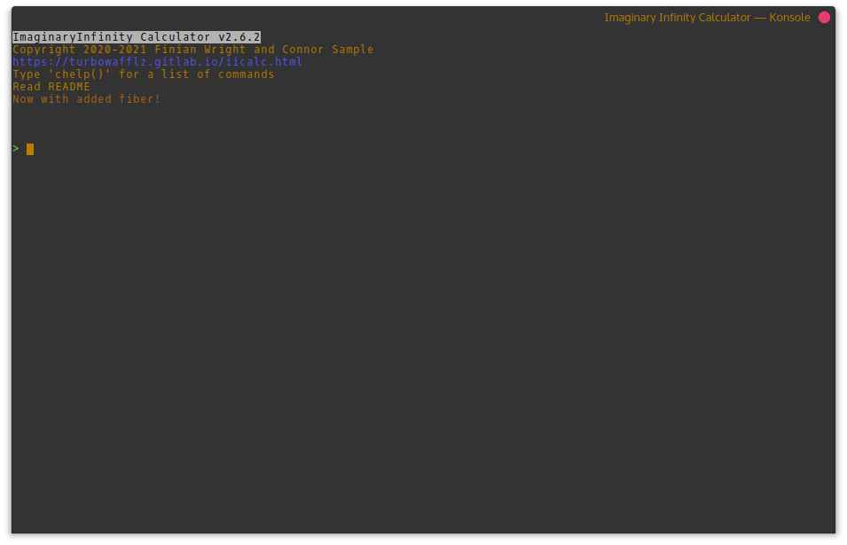

# ImaginaryInfinity Calculator
ImaginaryInfinity Calculator is a lightweight, but expandable calculator. It's
command line interface is designed to resemble that of some graphing
calculators. To preform another operation on a result, simply type the operation you wish to preform (eg. "/5" to divide the previous result by 5). To use the previous result in a new calculation, just specify the operation after the new calculation (eg. "5-" to subtract the previous result from 5).


## Packages
We provide a packaged version of ImaginaryInfinity calculator for some Linux distributions. They can be found below.


#### Debian/Ubuntu
[Download](https://gitlab.com/TurboWafflz/ImaginaryInfinity-Calculator/-/jobs/artifacts/development/raw/iicalc.deb?job=debian%20packager) (iicalc.deb)

This package can be installed with apt, gdebi, qapt, etc.

#### Arch Linux
You can install the AUR package or download the package below. To install from the AUR:

```bash
git clone https://aur.archlinux.org/iicalc.git && cd iicalc
makepkg -s
sudo pacman -U *.pkg*
```

Or you can install it with the below package:

[Download](https://gitlab.com/TurboWafflz/ImaginaryInfinity-Calculator/-/jobs/artifacts/development/raw/iicalc-any.pkg.tar.zst?job=buildpkg) (iicalc-any.pkg.tar.zst)

This package can be installed using pacman, with `sudo pacman -U iicalc-any.pkg.tar.zst`

#### Red Hat
[Download](https://gitlab.com/TurboWafflz/ImaginaryInfinity-Calculator/-/jobs/artifacts/development/raw/iicalc.rpm?job=buildrpm) (iicalc.rpm)

This package can be installed or updated on Red Hat based systems, like Fedora and CentOS, using rpm, with `sudo rpm -Uhv iicalc.rpm`

#### AppImage
[Download](https://gitlab.com/TurboWafflz/ImaginaryInfinity-Calculator/-/jobs/artifacts/development/raw/ImaginaryInfinity_Calculator-x86_64.AppImage?job=AppImage%20packager) (ImaginaryInfinity_Calculator-x86_64.AppImage)

Just make executable and run on many Linux distributions

----

## Installation

The advantages of using an installed version of the calculator is that you can launch it from anywhere in a terminal, just by running the `iicalc` command. Installing it also adds a shortcut to your start menu, and if you're on Windows, you have the option to add a desktop shortcut.

#### Portable Mode
The calculator can be run without any installation on any device that supports Python 3. Just clone the repository and in the directory that  you cloned it to, run `python3 main.py`, or replace `python3` with your operating system's python command. (Windows is `py`, Android is `python`, etc.)

#### Linux/MacOS/Android installation
ImaginaryInfinity Calculator can be installed on Linux by installing the package for your operating system. If your operating system doesn't have a package or you don't want to install a package, you can use the installer script. Just go to the directory where you downloaded the calculator and run `bash installer.sh` in your terminal to install the calculator. The calculator can be easily uninstalled by running `bash uninstaller.sh` in the same directory.

#### Windows Installation
The calculator can be installed on Windows using the provided powershell script. First, search `powershell` in the windows start menu, right click it, and run it as administrator. Then run `Set-ExecutionPolicy Unrestricted`, and type "Y" to say yes. This makes it so that the installer script can run. Now, navigate to the directory where you downloaded the calculator, and run `.\installer.ps1`. The calculator can be easily uninstalled by opening a powershell session and running `.\uninstaller.ps1` in the same directory.

----

## Supported platforms
**ImaginaryInfinity Calculator fully supports the following platforms:**
- **Linux**
	- Primary development and testing OS. Should have the best support
- **Web** (repl.it)
- **Android**
	- Termux support covers all or most features including installation.

**ImaginaryInfinity Calculator has partial support for the following platforms:**
- **Haiku**
	- Haiku will regain full support once I upgrade my testing VM to the latest version
- **MacOS**
	- MacOS support is untested as I do not currently have access to a Mac
- **Windows**
	- Windows support receives much less testing than other platforms
- **Any other OS that can run Python 3**
	- Start an issue on GitHub and we may improve support for your OS

**ImaginaryInfinity Calculator has been tested to work on these platforms:**
- Debian/Ubuntu
- Arch Linux
- OpenBSD
- FreeBSD
- Red Hat Linux
- Alpine Linux
- Android (Termux)
- Windows 10

<hr style="border: 1px solid white">

## Plugins
New functionality can easily be added by placing Python files with additional functions in the plugins directory or by downloading plugins from the store. To access a function added by a plugin, type `[plugin].[function]()`. For example, if you wanted to run the function `egg` from the plugin `food`, you would type `food.egg()`. Arguments placed in the parentheses will be passed to the function.
##### Plugin Documentation
- [Adding custom config settings](addSettings.md)

**Note:**
Functions in the `core` plugin can be accessed without specifying `core`.
ex. `factor(7)` instead of `core.factor(7)`

<hr style="border: 1px solid white">

## Themes
The colors used by the calculator can be modified by themes. Themes are ini files that define the colors the calculator will use and are stored in the `themes` folder. To change the theme used by the calculator, run `settings.configMod("appearance", "theme", "<theme name>")`, or select a theme in the settings editor. One theme is included by default, `dark` for use on terminals with a dark background. If you use a terminal with a light background, you can download our official `light` theme from the store.

<hr style="border: 1px solid white">

## Built in commands:
The following commands are built in to the calculator or added by the "core" plugin:

- `settings.configMod("<section>", "<key>", "<value>")` - Changes a value in the config file.

- `settings.editor()` - Settings editor, not supported on all platforms

- `factor(<number>)` - Shows factor pairs for a number

- `factorList(<number>)` - Returns a list of the factors of a number

- `fancyFactor(<number>)` - Shows factor pairs and their sums and differences for
a number

- `iprt('<module>')` - Installs and imports a python module from PyPi

- `isPrime(<number>)` - Checks whether or not a number is is prime

- `isPerfect(<number>)` - Checks whether or not a number's factors add up to twice the
starting number

- `restart()` - Restarts iiCalc

- `clear()` or `clear` - Clears the screen

- `sh('<command>')` - Runs a command directly on your computer

- `update()` - Updates the calculator

- `quit()` - Quit ImaginaryInfinity Calculator

<hr style="border: 1px solid white">

## Plugin store

#### CLI Store

- `pm.update()` - Update the package list, this must be run before plugins can be installed or to check for updates

- `pm.install("<plugin>")` - Installs a plugin from the plugin index

- `pm.list("<available/installed>")` - List plugins

- `pm.search("<term>")` - Search the plugin index

- `pm.info("<plugin>")` - Show info about a plugin

- `pm.upgrade()` - Install all available updates

- `pm.remove("<plugin>")` - Removes an installed plugin

- `pm.installFromFile("<filename>")` - Install a plugin from a local \*.icpk file

#### GUI Store

- `store.store()` - Runs the GUI version of the plugin store

**Note:** In the GUI search box, you can specify `type:<type>` anywhere in the query to search for types of plugins. You can add a subquery by specifying it after the type. Example: `type:plugins discord` to search for only plugins with the keyword of discord or `light type:theme` to search for only themes with the keyword of light. Types of plugins include:

- plugin(s)
- theme(s)

#### Submitting a plugin
You can submit a plugin to the store by clicking [here](https://turbowafflz.azurewebsites.net/iicalc/auth). The plugin must fit the guidelines which can be found [here](guidelines.md). Violating these guidelines may result in your plugins being removed and a permanent ban from submitting plugins.

**Disclaimer:** Even though we try to filter out malware, we cannot catch everything. We are not responsible for any damage caused by using user-created content. By using ImaginaryInfinity Calculator or any of it's services, you agree that no contributers to ImaginaryInfinity Calculator are responsible for any harm or damage caused by the usage of user-created content.

<hr style="border: 1px solid white">

**The following commands accept a second argument to prevent the result from being
printed. This is useful when they are used in another function so they don't
all get shown to the user:**

- `factorList(<number>, [printResult])`
- `isPrime(<number>, [printResult])`
- `isPerfect(<number>, [printResult])`
- `toStd("<value>", [roundVal], [printResult]) - Convert e notation number to standard notation`

printResult can be set to `True` or `False`, and defaults to `True` if not specified


